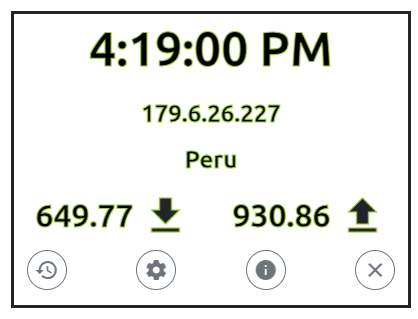
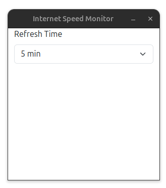
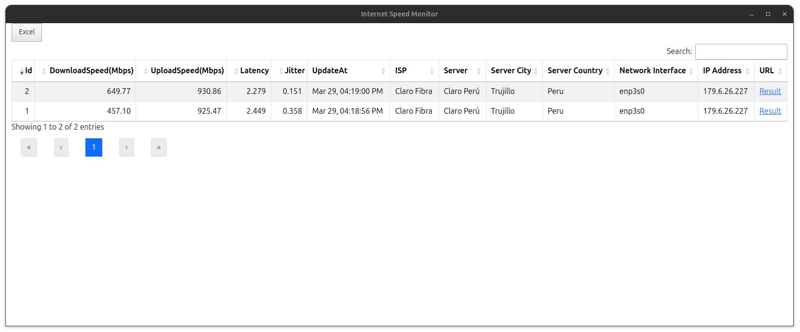

# Internet Speed Monitor

Aplicación de escritorio que mide periódicamente la velocidad de tu conexión usando [Ookla Speedtest CLI](https://www.speedtest.net/apps/cli) y muestra los resultados en una interfaz limpia y en tiempo real.

Construida con [Electron](https://www.electronjs.org/) y [Angular](https://angular.dev/).

---

## Características

- **Lecturas en vivo** de descarga, subida, latencia y jitter en intervalos configurables.
- **Historial de mediciones** con ISP, servidor, dirección IP y URL del resultado.
- **Intervalo configurable** entre 5, 10, 15, 20, 30, 40, 50 o 60 minutos.
- **Overlay siempre visible** con ventana compacta y transparente.
- **Persistencia local** en SQLite dentro del directorio del usuario.
- **Logging estructurado** con rotación en `~/.internet-speed-monitor/logs/`.

---

## Capturas

|                      App                       |                     Configuración                      |
|:----------------------------------------------:|:------------------------------------------------------:|
|  |  |

**Historial**



---

## Requisitos

### Runtime

| Dependencia | Versión |
|---|---|
| Node.js | ≥ 24 |
| npm | ≥ 10 |

### Dependencias de build en Linux

| Paquete | Propósito |
|---|---|
| `libsqlite3-dev` | Compilar el módulo nativo `better-sqlite3` |
| `python3` | Requerido por `node-gyp` |
| `build-essential` | GCC / make |

```bash
sudo apt install libsqlite3-dev python3 build-essential
```

### Dependencias de build en Windows

Se requieren Visual Studio Build Tools con la carga de trabajo de C++ para compilar `better-sqlite3`.

Descarga:
[visualstudio.microsoft.com](https://visualstudio.microsoft.com/downloads/)

---

## Preparación del entorno de desarrollo

```bash
# 1. Clona el repositorio
git clone https://github.com/Rigo85/internet-speed-monitor-ng.git
cd internet-speed-monitor-ng

# 2. Instala dependencias
#    postinstall recompila better-sqlite3 para la versión de Electron usada
npm install

# 3. Inicia la app en modo desarrollo
npm start
```

`npm start` ejecuta tres pasos en secuencia:

1. Compila el frontend Angular (`ng build --base-href ./`)
2. Compila el main process de Electron (`tsc -p electron-app-tsconfig.json`)
3. Lanza Electron (`electron .`)

### DevTools

Si quieres abrir Chrome DevTools automáticamente:

```bash
DEV_TOOLS=true npm start
```

---

## Estructura del proyecto

```text
internet-speed-monitor-ng/
├── core/                        # Lógica principal del main process
│   ├── OoklaSpeedTester.ts      # Ejecuta el binario speedtest y parsea JSON
│   ├── getIp.ts                 # Obtiene IP pública
│   ├── headers.ts               # Interfaces TypeScript compartidas
│   ├── Settings.ts              # Singleton para DB y repositorios
│   └── db/
│       ├── AppDAO.ts            # Wrapper de better-sqlite3
│       ├── SettingsRepository.ts
│       └── SpeedTestRepository.ts
│
├── shared/
│   └── constants.ts             # Rutas de datos de la app
│
├── src/                         # Frontend Angular
│   └── app/
│       ├── components/
│       │   ├── main/            # Vista principal
│       │   ├── history/         # Historial con DataTables
│       │   └── settings/        # Configuración de intervalo
│       └── services/
│           └── electron.service.ts   # Bridge IPC para el renderer
│
├── src-electron-app/            # Main process de Electron
│   ├── main.ts                  # Punto de entrada
│   ├── ElectronApp.ts           # Scheduling, IPC y lifecycle
│   ├── browserWindowHelper.ts   # Creación de ventanas
│   ├── desktop-integration.ts   # Integración Linux en primer arranque
│   ├── logger.ts                # Logger con rotación
│   ├── preload.ts               # API segura expuesta al renderer
│   └── utils.ts                 # Helpers de formato
│
├── core/ookla-speedtest/        # Binarios de Ookla por plataforma
│   ├── linux/speedtest
│   └── win32/speedtest.exe
│
├── test/unit/                   # Tests unitarios con Vitest
│   ├── speed-tester.test.ts
│   ├── logger.test.ts
│   └── speed-history.test.ts
│
├── scripts/
│   └── uninstall.sh             # Desinstalación completa
│
└── .github/workflows/
    └── release.yml              # CI/CD de test, build y release
```

---

## Almacenamiento de datos

Todos los datos del usuario viven en su directorio personal, no dentro del bundle de la aplicación:

| Ruta | Contenido |
|---|---|
| `~/.internet-speed-monitor/database.sqlite3` | Historial de mediciones y configuración |
| `~/.internet-speed-monitor/logs/app.log` | Log principal con rotación |

En **Windows**: `%APPDATA%\internet-speed-monitor\`

---

## Empaquetado para distribución

### Linux (AppImage + tar.gz)

```bash
npm run dist:linux
# Salida:
#   release/Internet Speed Monitor-<version>.AppImage
#   release/Internet Speed Monitor-<version>.tar.gz
```

### Windows (NSIS installer + zip)

```bash
npm run dist:win
# Salida:
#   release/Internet Speed Monitor Setup <version>.exe
#   release/Internet Speed Monitor-<version>-win.zip
```

---

## Instalación en Linux con AppImage

```bash
chmod +x "Internet Speed Monitor-1.0.0.AppImage"
./"Internet Speed Monitor-1.0.0.AppImage"
```

En el primer arranque la app crea automáticamente el `.desktop` e instala el icono para que aparezca en el menú de aplicaciones.

---

## Desinstalación en Linux

```bash
# Interactivo
bash scripts/uninstall.sh

# También elimina el AppImage si se indica la ruta
bash scripts/uninstall.sh --appimage ~/Downloads/"Internet Speed Monitor-1.0.0.AppImage"

# No interactivo
bash scripts/uninstall.sh --yes
```

El script elimina:

- `~/.internet-speed-monitor/` — base de datos y logs
- `~/.local/share/applications/internet-speed-monitor.desktop`
- `~/.local/share/icons/hicolor/256x256/apps/internet-speed-monitor.png`
- `~/.config/ookla/` — aceptación de licencia de Ookla

---

## Ejecución de pruebas

```bash
# Ejecuta todos los tests una vez
npm test

# Modo watch
npm run test:watch
```

Los tests usan [Vitest](https://vitest.dev/) y corren en entorno Node.js puro, sin navegador ni runtime de Electron.

### Cobertura actual

| Archivo de test | Cobertura |
|---|---|
| `speed-tester.test.ts` | Spawn del binario, parseo JSON y rutas de error |
| `logger.test.ts` | Escritura y rotación de logs |
| `speed-history.test.ts` | Conversión de velocidad e IP fallback |

---

## Arquitectura

### Comunicación IPC

```text
Angular renderer ──► preload.ts ──► ElectronApp.ts
Angular renderer ◄── preload.ts ◄── ElectronApp.ts
```

### Flujo principal

1. Electron inicia la ventana principal y el scheduler.
2. Se ejecuta Ookla Speedtest CLI.
3. El resultado base se guarda y se muestra inmediatamente.
4. La IP pública se resuelve en segundo plano.
5. Cuando llega la IP, se actualizan vista principal, DB e historial abierto.

### Resolución del binario speedtest

| Modo | Ruta |
|---|---|
| Desarrollo (`npm start`) | `<project-root>/core/ookla-speedtest/{platform}/speedtest[.exe]` |
| Empaquetado (AppImage / NSIS) | `<resources>/ookla-speedtest/{platform}/speedtest[.exe]` |
